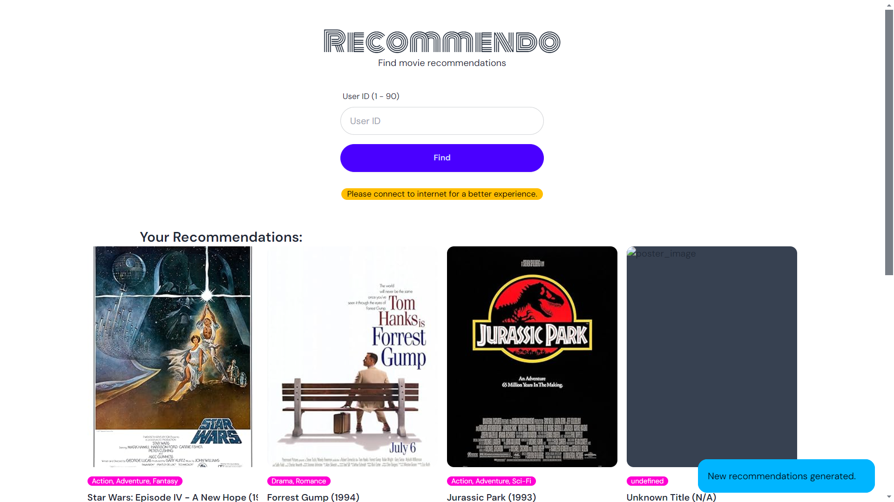
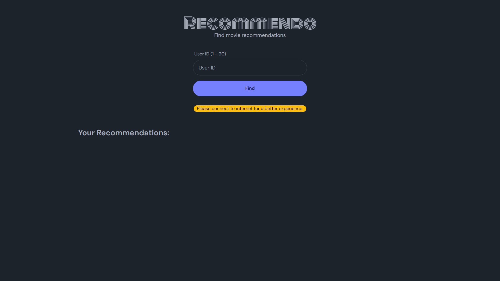

# Movie Recommendation System

This project implements a movie recommendation system designed to suggest movies to users based on their preferences.

### Project Overview

The system utilizes K-Means clustering, an unsupervised learning algorithm, to group users with similar movie tastes. Based on a user's ID, the system recommends movies popular among users in the same cluster.

### Technologies Used

- **Backend:** Python (Flask)
- **Frontend:** HTML, CSS (Tailwind CSS), JavaScript (Vanilla JS, Axios)
- **Data Source:** External Movie API [OMDB API](https://www.omdbapi.com/)
- **Machine Learning Algorithm:** K-Means Clustering
- **Python Libraries:**
  - Pandas
  - NumPy
  - Scikit-learn
  - Flask

### Getting Started

1. **Clone the project repository.**

```bash
git clone https://github.com/Codewith-ARK/movie-recommendation-system.git
cd movie-recommendation-system
```

2. **Create and activate Virtual Environment**

```bash
python -m venv .venv
```

  Activate virtual environment (windows):

    ```bash
    .venv\Scripts\activate
    ```

3. **Install dependencies:**

Ensure you have Python installed and then run in your terminal.

```python
pip install -r requirements.txt
```

4. **Run the application:**

Paste the following command in your terminal to start the Flask server

```python
python app.py
```

5. **Open the application:** Access the recommendations page at the following url in your web browser.

```text
http://127.0.0.1:5000
```

## Screenshots

- **Light Mode:**
  

- **Dark Mode:**
  
